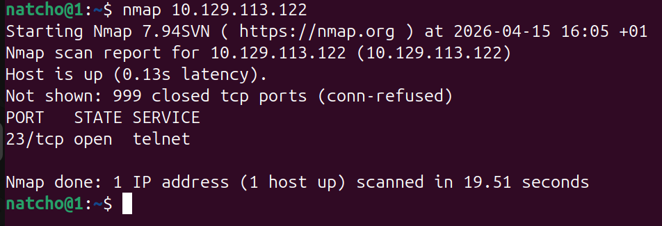
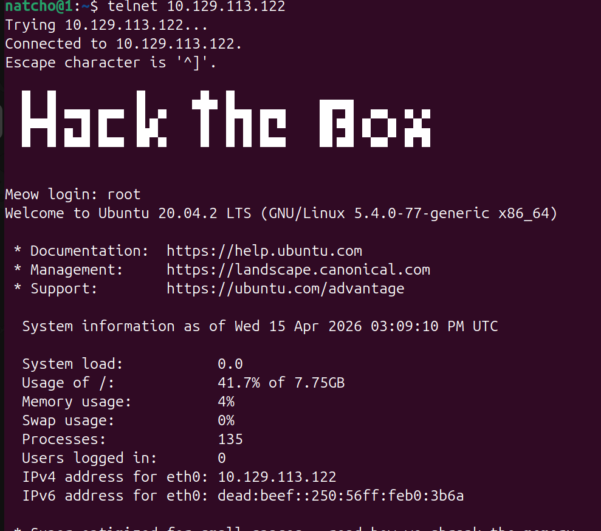
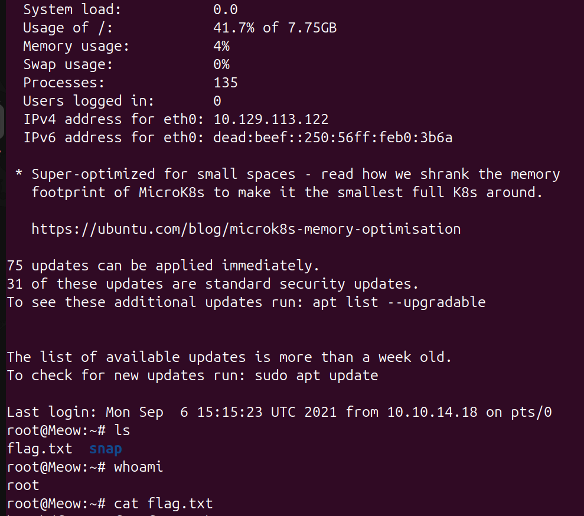

# 🐱 Meow - Hack The Box

##  Overview

- **Machine:** Meow  
- **Difficulty:** Easy  
- **Category:** Starting Point  

---

##  VPN Connection

Before starting, I connected to the Hack The Box VPN:

```bash
sudo openvpn starting_points_us-starting-point-1-dhcp.ovpn
```

##  Basic Concepts
Before attacking the machine, it's important to understand a few key concepts:

### VM (Virtual Machine): A virtualized computer system running inside another system
### Terminal: A command-line interface used to interact with the operating system
### VPN (OpenVPN): Used to connect securely to the Hack The Box lab environment
### Ping: Tool used to test connectivity via ICMP
### Nmap: A powerful tool used to discover open ports and services

---

##  Enumeration

To identify open ports and services, I performed the simplest Nmap scan:

```bash
nmap <IP>
```


### Analysis

The scan shows that only port 23 (Telnet) is open, which becomes the main attack vector.

## Exploitation
Let's try to connect to the machine via this protocol:
```bash
telnet <IP>
```
and let's try root as our user here


### Analysis

The system allows login as root without a password, indicating a critical misconfiguration.

✔️ Successfully gained root access.
LASTLY LET'S GET OUR FLAG



## ⚠️ Security Insight

Allowing root login over Telnet without authentication is a severe security flaw that can lead to full system compromise.


try it yourself.

Enjoy your ethical hacking :D


------

## Key Takeaways
Enumeration is the most important step

Misconfigured services = easy access

Telnet should never be exposed

## Skills Learned
Nmap scanning

Service enumeration

Telnet exploitation

